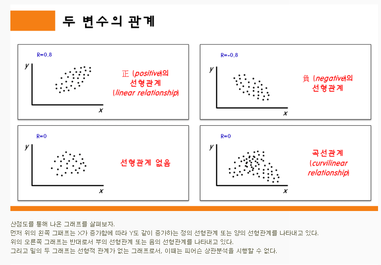

# Correlation Analysis

## Correlation Analysis.

- https://m.blog.naver.com/istech7/50153047118
- 두 변수 간의 밀접한 정도, 상관관계를 분석하는 통계적 분석 방법
-  두 변수 간의 선형적 관계에 초점을 맞추고 있다.
- 두 변수가 카테고리 변수가 아닌, Quantitative 변수여야 상관관계 분석이 가능하다.
  - ex. male, female 같은 categorical variable는 분석이 아예 불가능
  - 

## Correlation coefficient

* +1에서 -1까지 해서 상관관계의 크기를 나타낼 수 있다.
*  +1은 가장 높은 양의 상관관계를 뜻하고, -1은 가장 높은 음의 상관관계를 뜻한다.

* 상관관계의 종류와 자료
  * Pearson
  * spearman

## Pearson's Correlation

* 

## Spearman's Correlation

* 

# Variable 종류

https://blog.naver.com/PostView.nhn?blogId=y4769&logNo=220227007641

https://m.blog.naver.com/PostView.naver?isHttpsRedirect=true&blogId=shineebiblee&logNo=220166758074

* 변수는 2가지로 나눌 수 있다. Quantitative, Categorical
* Quantitative( 양적 척도 )는 숫자로 측정되는 것들 : 나이, 연도 등
  * interval scale ( 등간 척도 ) : 
  * Ratio scale ( 비율 척도)

* Categorical( 범주 척도 )는 2가지로 나뉜다.
  * Nominal scale (명목 척도) : 카테고리가 순서적으로 배열되어 있지 않는 경우
  * Ordinal scale (서열 척도) : 카테고리가 순서적으로 배열되어 있는 경우
    * ex.  초등학교 1학년 ~ 6학년으로 카테고리 나누기 : Ordinal scale

